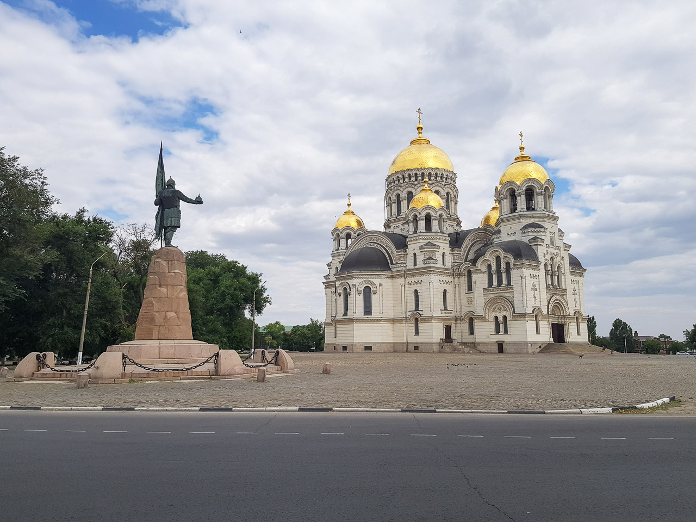
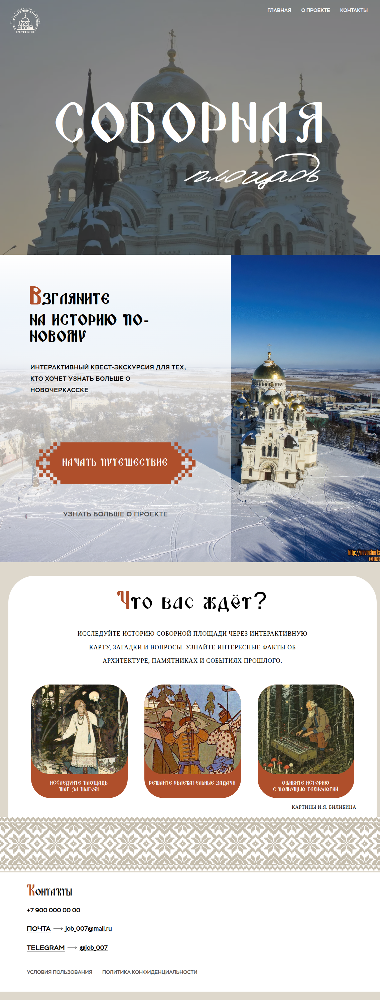
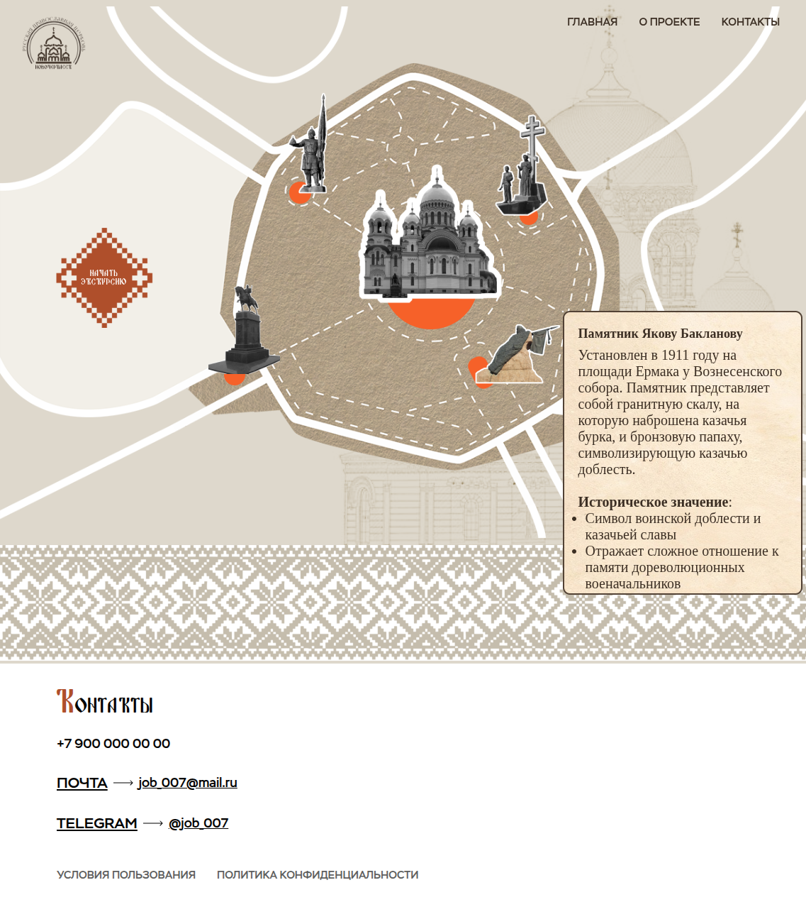
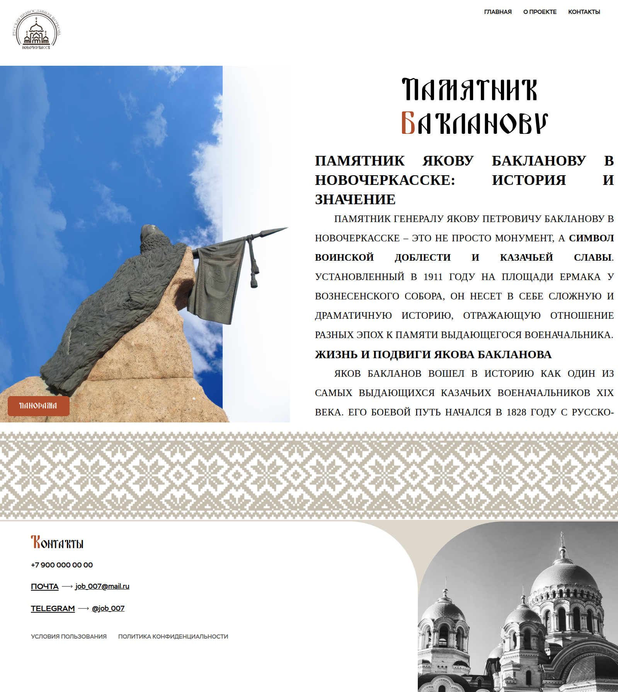
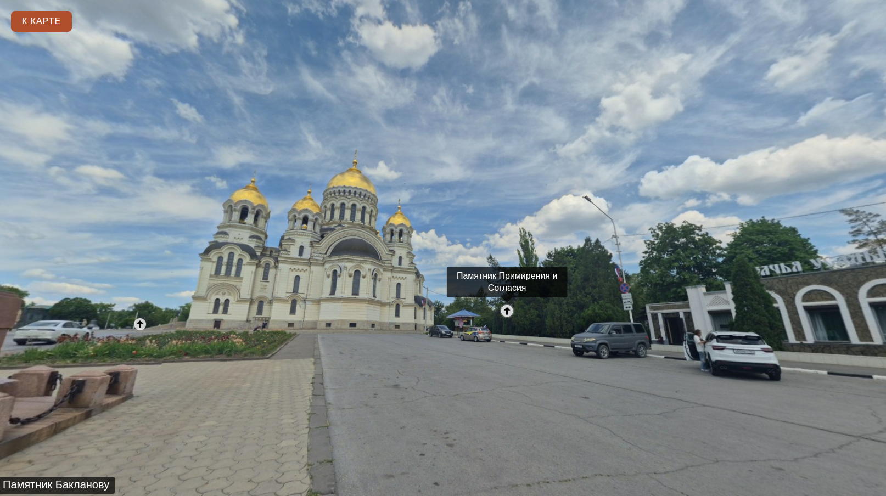

# Интерактивная квест-экскурсия по Соборной площади Новочеркасска

**Проект-демонстрация**: [https://sobor.netlify.app/html](https://sobor.netlify.app/html)  

---

## 📌 О проекте

Это интерактивная веб-экскурсия по Соборной площади города Новочеркасска — исторического и культурного центра донского казачества. Проект создан как образовательный и туристический ресурс, помогающий пользователям:

- Исследовать ключевые достопримечательности площади:  
  🗽 Памятник Ермаку  
  🗽 Памятник Якову Бакланову  
  🗽 Вознесенский Кафедральный Собор  
  🗽 Памятник Матвею Платову  
  🗽 Мемориал «Примирения и согласия»

- Узнавать интересные исторические факты через интерактивные элементы:  
  💬 исторические справки,  
  🖼️ иллюстрации И. Я. Билибина.

- Погружаться в атмосферу прошлого с помощью 360° панорам (через библиотеку **Pannellum**).

Разработан как учебный/портфолио-проект с акцентом на UX, доступность и визуальную эстетику.

---

## 🌐 Как это работает?

1. **Главная страница** (index.html) знакомит пользователя с концепцией квеста.
2. **Интерактивная карта** (map.html) позволяет:
   - кликать по объектам на карте,
   - открывать подробную информацию о каждом памятнике,
   - переходить к 360° панораме этого места.
3. Каждый объект имеет свою страницу с историей, визуальным оформлением и ссылкой на панораму.
4. Поддержка мобильных устройств: карта адаптируется под альбомную ориентацию для лучшего восприятия.

---

## 🛠️ Технологии

- **HTML5 / CSS3** — структура и стилизация с использованием собственных шрифтов (Stem, Zabava).
- **JavaScript** — интерактивность карты и управление переходами.
- **Pannellum** — просмотр 360° панорам.
- **Адаптивный дизайн** — корректное отображение на разных устройствах.
- **Статическая вёрстка** — проект не требует бэкенда, легко деплоится на Netlify, GitHub Pages и др.

---

## 🎯 Целевая аудитория

- Школьники и студенты, изучающие историю Дона.
- Туристы и гости Новочеркасска.
- Преподаватели и экскурсоводы как цифровой сопровождающий материал.

---

## 🖼 Галерея

### Видео/трейлер
<video src="https://github.com/user-attachments/assets/35fabcb8-a72d-4105-97a2-cac1347981ca"></video>

### Главная страница

### Карта

### Страница об достопремичательности

### Панорама

---

> ✨ «Взгляните на историю по-новому» — девиз этого проекта.

---

© Учебный проект, 2025
